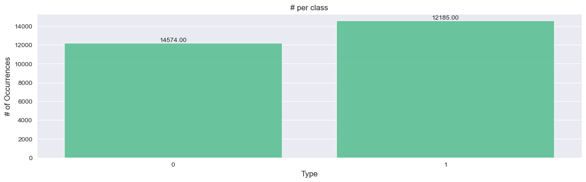
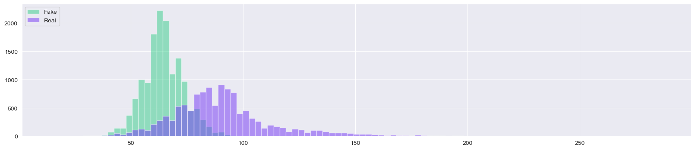

# News Agency: Filter of the News

> [!important]  
> This is a summary of the project; all the information can be found here.


## Table of Contents

1. [Introduction](#introduction)
2. [Dataset](#dataset)
3. [Objectives](#objectives)
4. [EDA Insights](#eda-insights)
5. [Engineered Features](#engineered-features)
6. [Model Selection](#model-selection)
7. [Model Explainability](#model-explainability)
8. [Prediction Service](#prediction-service)
9. [Next Steps](#next-steps)

---

## Introduction

Our company leverages advanced AI technology to revolutionize how people consume news. By aggregating news from diverse and trusted websites, we create concise summaries that are transformed into engaging 2-3 minute audio clips. This service enables users to stay informed about global events efficiently, even with a busy schedule.


### Key Features
- **Customizable Content**: Users can select specific topics or areas of interest, such as politics, technology, sports, or entertainment.
- **Convenient Audio Format**: Hands-free news consumption is ideal for multitasking, commuting, or on-the-go lifestyles.
- **Timely Updates**: Frequent updates ensure users have access to the latest developments.

This innovative approach addresses the growing demand for quick, personalized, and accessible news, creating a unique value proposition in the digital media landscape.

To succeed, we must validate the news sources. Our goal is to develop an algorithm that detects the veracity of news extracted from various sources.

---

## Dataset

The dataset for this project can be found on [Kaggle](https://www.kaggle.com/datasets/emineyetm/fake-news-detection-datasets).

- **Labels**:  
  - 0 = Real news  
  - 1 = Fake news  

- **Dataset Split**:
  - 80% for training
  - 10% for validation
  - 10% for testing  

To maintain consistent proportions, we applied stratification when combining the datasets. Additionally, we sampled 30% of the training data for faster hyperparameter testing.

---

## Objectives

> **To develop a system that detects fake news**

### Sub-Objectives:
1. Perform in-depth exploratory data analysis (EDA) of the datasets.
2. Engineer predictive features from the data.
3. Develop a baseline model.
4. Test at least two advanced models:
   - Roberta
   - DistilBERT
5. Analyze model predictions to understand feature importance.
6. Deploy the model using MLflow.

---

## EDA Insights

### Key Findings:
- The dataset is imbalanced (~46% on one side), but manageable with weights.  
    

- Differences in the total length of fake vs. real news are significant.  
    

- By leveraging categories, we observed two predictable subsets, requiring further validation.  
- Data was filtered to include only entries after January 2016.  
    

- Token similarities confirm effective feature space organization.

Find the full EDA notebook here: [001_EDA](001_EDA.ipynb)

---

## Engineered Features

### Extracted Features:
1. **Word Count Features**:
   - Total word count
   - Unique word count
   - Stopword count
   - Title word count
2. **Punctuation Features**:
   - Punctuation count
   - Question mark count
   - Exclamation mark count
3. **Word Length Features**:
   - Average word length
   - Total text length
   - Line breaks
4. **Derived Features**:
   - Unique word percentage
   - Punctuation percentage  

Unnecessary characters and parentheses were removed during preprocessing.

Overfitting was identified in early models due to feature complexity, leading to feature reduction in later iterations.

---

## Model Selection

### Baseline Model:
- Logistic Regression achieved an F1 score of 98%.  
  Notebook: [002_basemodel](002_basemodel.ipynb)  

### Advanced Models:
- Used LIME for interpretability: [003_XAI](003_XAI.ipynb)  
- Experimented with Roberta and DistilBERT for hyperparameter tuning:  
  - [005_Roberta Hyperparameters](005_roberta_hyperparameters_experiment.ipynb)  
  - [006_DistilBERT Hyperparameters](006_distilbert_hyperparameters_experiment.ipynb)  


| **Model**                             | **Train F1** | **Train Loss** | **Val Accuracy** | **Val F1** | **Model Name**  |
|---------------------------------------|--------------|----------------|------------------|------------|-----------------|
| `training_Fake news comments_trial_5` | **99.32%**   | 50.04%         | **99.56%**       | **99.60%** | roberta-base    |
| `training_Fake news comments_trial_11`| 99.11%       | 49.92%         | 99.42%           | 99.47%     | roberta-base    |
| `training_Fake news comments_trial_10`| 97.76%       | 51.37%         | 99.34%           | 99.39%     | roberta-base    |
| `training_Fake news comments_trial_14`| 98.79%       | 50.04%         | 99.14%           | 99.21%     | roberta-base    |
| `training_Fake news comments_trial_8` | 98.10%       | 49.99%         | 98.94%           | 99.02%     | roberta-base    |


This improves readability and ensures the table adheres to Markdown styling conventions.

**Final Parameters**:  
```json
{
    {
  "BATCH_SIZE": 8,
  "EPOCHS": 3,
  "THRESHOLD_PROBABILITIES_MODEL": 0.5,
  "MAX_TOKENS": 512,
  "LEARNING_RATE": 0.002500000075,
  "WEIGHT_DECAY": 0.01,
  "DROPOUT_VALUE": 0.139164305582066,
  "WARMUP_RATIO": 0.192605760830724,
  "OPTIMIZER_NAME": "AdamW",
  "SCHEDULER": {
    "TYPE": "LinearScheduleWithWarmup",
    "WARMUP_RATIO": 0.192605760830724
  }
}
```

This its the final result Accuracy=99%, F1 Score=99%

Full training notebook: [010_roberta_all_data](010_roberta_all_data.ipynb)

---

## Model Explainability

We analyzed incorrect predictions to identify potential biases, revealing features like word length and specific tokens influencing the model.  

Good prediction
  

Bad prediction
  

Notebook: [011_XAI_roberta](011_XAI_roberta.ipynb)

---

## Prediction Service

Deployed the model using Mlflow and tested local inference times:  

| **Response Time**             | **Measure**       |
|-------------------------------|-------------------|
| 100 iterations (1 sample)     | 5.9273 seconds    |
| Average time per sample        | 0.0593 seconds    |

Notebook: [012_Inference_time](012_Inference_time.ipynb)

---

## Next Steps

- Experiment with thresholds to improve accuracy.
- Generate synthetic data to enhance generalization.
- Retrain with fewer epochs to mitigate overfitting.

---

## Authors

* [Hanns Juarez](https://github.com/auszed)
